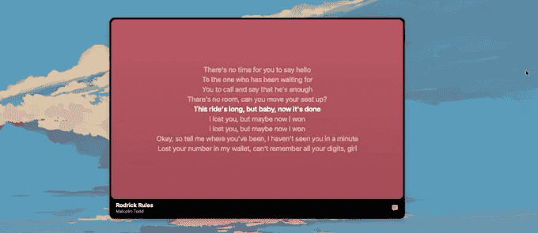

<div align="center">


# Lyrify

**Lyrics that keep up with the music.**

A menu-bar companion for Spotify on macOS that floats a small, time-synced
lyrics overlay over whatever you're doing — and follows you across every
desktop and every fullscreen window.

[](https://www.apple.com/macos/)
[](https://swift.org)
[](#install)
[](https://lyrify.dev)



[**Download**](https://github.com/hemantwasthere/lyrify/releases/latest) ·
[Website](https://lyrify.dev) ·
[Report a bug](https://github.com/hemantwasthere/lyrify/issues/new)

</div>

---

## What it does

- **Lyrics that arrive on cue.** Every line is timed to the second. The current
  line is highlighted the moment it's sung and the next waits dimmed below —
  never a wall of static text.
- **Follows you everywhere.** Stays above every desktop Space and every
  fullscreen app or game, so you never alt-tab back to Spotify to see what's
  playing.
- **Resizes like it means it.** Drag it down to a slim now-playing band or open
  it up to a full lyrics panel. The layout reflows as you go, and a taller card
  shows more lines at a larger size rather than more empty space.
- **Full transport control.** Play, pause, skip, scrub, shuffle, repeat, volume
  and share — Lyrify drives Spotify, it doesn't just watch it.
- **Feels native.** Real window behaviour: drag from anywhere, resize from any
  edge or corner, hover-revealed controls, and a red close dot that does what a
  red close dot does. No dock icon, no clutter.
- **Remembers itself.** Position, size, whether it's expanded, and whether the
  artwork tints the panel all survive a restart.

## Requirements

| | |
|---|---|
| **macOS** | 14 Sonoma or later |
| **Architecture** | Apple Silicon & Intel |
| **Spotify** | The desktop client, installed and running |
| **Network** | Lyrics are fetched from [LRCLIB](https://lrclib.net) |

Lyrify reads playback state from the Spotify desktop app over Apple Events. It
does **not** use the Spotify Web API, so there is no account to connect, no
token to manage, and nothing leaves your machine except an anonymous lyrics
lookup by track title, artist, album and duration.

## Install

1. Download the latest `Lyrify-x.y.z-macOS.zip` from
   [Releases](https://github.com/hemantwasthere/lyrify/releases/latest).
2. Unzip it and move **Lyrify.app** to `/Applications`.
3. Clear the quarantine flag:

   ```sh
   xattr -cr /Applications/Lyrify.app
   ```

   This step is not optional, and it's worth knowing why. Lyrify is **ad-hoc
   signed and never notarized** — there's no paid Apple Developer account behind
   it. macOS therefore refuses to open it and reports, misleadingly, that the app
   is *damaged*. It isn't; it simply carries no Apple-issued signature. The
   command above removes the quarantine attribute that triggers that check.

4. Open Lyrify. It settles into the menu bar with no dock icon.

5. **Grant Automation permission.** The first time it reads Spotify, macOS asks
   whether Lyrify may control it. Say yes — without it Lyrify can neither see
   what's playing nor drive playback. If you dismiss the prompt by accident,
   re-enable it under **System Settings → Privacy & Security → Automation →
   Lyrify → Spotify**.

## Using it

**The menu bar** shows Lyrify's mark and nothing else — the overlay is where the
track is named. Its menu says whether synced lyrics were found for what's
playing, and carries **Show Overlay** (put the overlay away without quitting),
**Minimize to Disc**, and **Quit Lyrify** (<kbd>⌘</kbd><kbd>Q</kbd>).

**The overlay** has three forms, and you move between them by dragging its edges:

| Form | What it is |
|---|---|
| **Disc** | A small circle, spinning while a track plays. Click to expand; **Minimize to Disc** in the menu bar is the way back. |
| **Portrait** | The tall shape: artwork on a panel tinted from the cover, progress, then title and artist. Transport sits over the artwork and appears on hover. |
| **Band** | Once short enough: a single row — artwork, title, and transport. Controls shed from the outside in as it narrows. |

Point at the overlay and its furniture fades in: the close dot, drag dots, and
settings. Drag from anywhere on the card to move it; grab any edge or corner to
resize. The **speech-bubble button** swaps the artwork for lyrics, and the
**sliders button** opens settings.

Settings holds two switches. *Background color* controls whether the whole card
— panel, chrome bar and all — takes its colour from the album art. *Lyrics only*
holds the card on the lyrics and takes away the title, artist and button beneath
them, giving that strip to the words instead; the card keeps its size, so the
lyrics simply get a line more room. It applies at every size, and a short wide
card in this mode is nothing but lyrics until you point at it.

The close dot quits Lyrify, the way a red dot does everywhere else on the system.
To put the overlay away and keep it running, use **Show Overlay** in the menu bar.

## Build from source

```sh
git clone https://github.com/hemantwasthere/lyrify.git
cd lyrify

swift build                 # compile
swift test                  # 109 tests across 14 suites
bash Scripts/build-app.sh   # assemble .build/Lyrify.app
```

`Scripts/build-app.sh` takes `debug` (default) or `release`. The bundle is not
optional: the Automation prompt needs a bundle identifier and
`NSAppleEventsUsageDescription` to attach to, and `LSUIElement` is what keeps
Lyrify out of the Dock. The script ad-hoc signs the result, because macOS keys
the granted Automation permission to a signature — an unsigned rebuild would
re-prompt on every launch.

> **Note:** `build-app.sh` produces a **host-architecture** bundle, which is right
> for development but not for distribution. A release needs a hand-rolled
> universal build.

### Layout

```
Sources/
  LyrifyCore/     Pure logic — parsing, timing, selection. No AppKit. Fully tested.
  LyrifyApp/      The AppKit application: overlay, menu bar, Spotify bridge.
Tests/            LyrifyCoreTests
Resources/        Info.plist, icons, and the brand source drawings
Scripts/          build-app.sh, render-brand.mjs
site/             The landing page — Next.js + Tailwind
```

The split matters. `LyrifyCore` holds everything with a decision in it —
timestamp parsing, which line is current, how a panel's height maps to a line
count — and has no AppKit dependency, so it's testable without a running app.
`LyrifyApp` is views and event handling, and its layout is verified by hand;
several files say so in their own doc comments.

### The website

```sh
cd site
pnpm install
pnpm dev
```

### Brand assets

Every icon and raster is generated from one drawing. Edit
`Resources/Brand/app-icon.svg`, then:

```sh
node Scripts/render-brand.mjs
```

That regenerates the web icon set, the site's favicons and touch icon, the
social card, and both `.icns` archives. Nothing under `Resources/Brand/web/` or
`site/public/` should ever be edited by hand — re-running the script is
deterministic, so a hand edit will silently disappear on the next run.

## How it works

Lyrify keeps its own clock. Spotify is polled over AppleScript for a playback
anchor — track, position, playing state — and a local clock advances from that
anchor between polls, so lyrics scroll smoothly instead of stepping once per
poll. Spotify's own distributed notifications re-anchor it whenever the user
changes something.

Lyrics come from [LRCLIB](https://lrclib.net), matched on title, artist, album
and duration. The match **fails closed**: if the returned lyrics can't be
confidently tied to the playing track, Lyrify shows nothing rather than
confidently scrolling the wrong song.

## Credits

Synced lyrics are provided by **[LRCLIB](https://lrclib.net)**, a free and open
lyrics database. Lyrify would not exist without it.

## Disclaimer

Lyrify is an independent project. It is **not affiliated with, endorsed by, or
sponsored by Spotify AB**. Spotify is a trademark of Spotify AB. Lyrify controls
the Spotify desktop client through macOS Automation, the same mechanism any
scriptable Mac app exposes.
